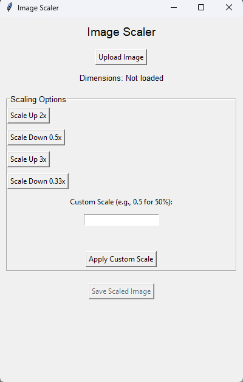

# Image Scaler for ComfyUI / Automatic1111  

  
  

A tiny, drag-free Tkinter GUI that lets you **scale any image up or down** (2x, 3x, 0.5x, 0.33x or any custom factor) while showing the **exact resulting pixel dimensions**.  

Perfect for **ComfyUI** and **Automatic1111** workflows when you need to:

* **Upscale** a low-res input so a high-res model can generate a richer latent.  
* **Downscale** a huge output to fit inside the VRAM of your GPU (e.g., turn a 4K image into 1024x1024 for a 12 GB card).  

---

## Why this tool?

| Problem | Solution |
|---------|----------|
| Powerful generators (SDXL, Flux, etc.) need **large latents** → out-of-memory on modest GPUs | **Downscale** the source image first, run the model, then upscale the result with an ESRGAN model. |
| You have a **tiny reference** but want a **high-res generation** | **Upscale** the reference 2x/3x, feed it to the model, get a crisp latent. |
| You need **exact pixel counts** for ComfyUI nodes (ControlNet, IP-Adapter, etc.) | The GUI **displays the final width × height** for every scale button **before** you apply it. |

---

## Screenshot

*(Replace the placeholder with a real screenshot of the GUI)*

```markdown


Features

One-click scaling – 2x up, 0.5x down, 3x up, 0.33x down.
Custom scale – type any factor (e.g., 0.75 → 75 %).
Live dimension preview – see 1920×1080 → 3840×2160 instantly.
High-quality resize – Pillow’s Lanczos filter (great for AI pipelines).
Output folder – scaled_images/ with timestamped PNG files.
Zero external deps – only Pillow (installed automatically).

Quick Start
bat
:: 1. Clone the repo
git clone https://github.com/Plasmaphantom/comfyui-image-scaler.git
cd comfyui-image-scaler

:: 2. Run the helper (creates venv, installs Pillow, launches GUI)
setup_and_run.bat
Close the window when you’re done – no browser will open.

Manual Installation (optional)
python -m venv venv
venv\Scripts\activate
pip install Pillow
python image_scaler.py

How to use with ComfyUI

Open the GUI → Upload your source image.
Pick a scale that fits your VRAM budget or the resolution your model expects.
Example:
Source = 2048×2048 → Scale Down 0.5x → 1024×1024 (fits 12 GB).
Click Save Scaled Image.
Drag the saved file into ComfyUI’s Load Image node.
Run your workflow – the latent now matches the model’s native resolution.

Tip: After generation, upscale the result with an ESRGAN or 4x-UltraSharp model to recover full detail.

Folder Layout
.
├─ image_scaler.py          # Main GUI script
├─ setup_and_run.bat        # Windows one-click launcher
├─ scaled_images/           # ← your resized PNGs appear here
└─ README.md

License
MIT – do whatever you want with it.

Happy scaling!
